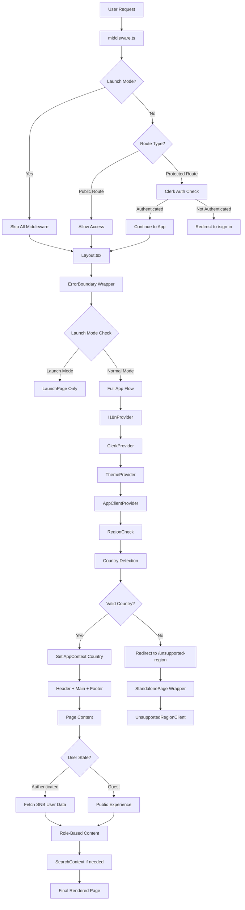

# SoNoBrokers Application Flow Architecture

## 📑 Table of Contents

1. [📋 Executive Summary](#-executive-summary)
2. [🏗️ Application Overview](#️-application-overview)
3. [🔄 Architectural Flow Diagram](#-architectural-flow-diagram)
4. [🚀 Detailed Flow Analysis](#-detailed-flow-analysis)
5. [🔧 Technical Implementation Details](#-technical-implementation-details)
6. [⚡ Performance Considerations](#-performance-considerations)
7. [🔒 Security Implementation](#-security-implementation)
8. [📈 Scalability Architecture](#-scalability-architecture)
9. [📊 Monitoring and Observability](#-monitoring-and-observability)
10. [📁 Folder Structure Analysis](#-folder-structure-analysis)
11. [🔮 Future Enhancements](#-future-enhancements)
12. [🎯 Current Status & Issues](#-current-status--issues)
13. [📝 Conclusion](#-conclusion)

---

## 📋 Executive Summary

This document provides a comprehensive analysis of the SoNoBrokers application flow architecture, detailing the request lifecycle, authentication mechanisms, regional routing, and state management patterns. The application implements a sophisticated multi-layered architecture designed to handle geolocation-based routing, role-based authentication, and dynamic content delivery across three primary markets: Canada (CA), United States (US), and United Arab Emirates (UAE).

## 🏗️ Application Overview

SoNoBrokers is a for-sale-by-owner (FSBO) real estate marketplace that eliminates traditional broker dependencies while providing comprehensive property management and professional service coordination. The platform operates across multiple countries with localized content, currency, and regulatory compliance requirements.

**Key Features:**

- 🌍 Multi-country support (CA, US, UAE)
- 🔐 Role-based authentication and authorization
- 🏠 Property listing and management
- 👥 Professional service provider network
- 💼 Concierge services for premium users
- 📱 Responsive design with mobile-first approach

## 🔄 Architectural Flow Diagram



## 🚀 Detailed Flow Analysis

### 1. Request Initiation Layer

```
User Request → middleware.ts
```

Every incoming request first encounters the middleware layer, which serves as the application's traffic controller. This initial checkpoint determines the request's routing path based on several critical factors:

- **Launch Mode Detection**: Checks if the application is in launch mode (controlled by `NEXT_PUBLIC_LAUNCH_MODE` environment variable)
- **Route Classification**: Categorizes requests as public or protected
- **Authentication Requirements**: Determines if Clerk authentication is required

**Implementation:**

```typescript
export default clerkMiddleware(async (auth, req) => {
  try {
    const url = req.nextUrl;
    const pathname = url.pathname;

    // Skip middleware logic in launch mode
    if (isLaunchMode()) return;

    // Route classification and processing
    if (isPublicRoute(req)) return;
    if (isProtectedRoute(req)) {
      // Authentication logic
    }
  } catch (error) {
    // Error handling
  }
});
```

### 2. Launch Mode Decision Point

```
middleware.ts → {Launch Mode?}
```

The application supports two distinct operational modes:

**🚀 Launch Mode (Enabled)**

- Bypasses all middleware authentication checks
- Displays only the launch page with waitlist functionality
- Minimal resource loading for optimal performance
- Used during pre-launch marketing phases

**🏢 Normal Mode (Disabled)**

- Full application functionality enabled
- Complete authentication and routing logic active
- All features and pages accessible

### 3. Route Protection Layer

```
{Route Type?} → Public Route | Protected Route
```

The middleware implements sophisticated route protection using Clerk's `createRouteMatcher` utility:

**🌐 Public Routes (No Authentication Required)**

- Landing pages (`/`, `/ca`, `/us`, `/uae`)
- Authentication pages (`/sign-in`, `/sign-up`)
- API endpoints (`/api/geo`, `/api/waiting-list`, `/api/contact-concierge`)
- Development utilities (`/region-tester`, `/unsupported-region`)

**🔒 Protected Routes (Authentication Required)**

- Dashboard pages (`/ca/dashboard`, `/us/dashboard`, `/uae/dashboard`)
- Admin interfaces (`/ca/admin`, `/us/admin`, `/uae/admin`)
- Role-specific pages (`/ca/product`, `/us/operator`, `/uae/service-provider`)
- User API endpoints (`/api/user/*`, `/api/admin/*`)

### 4. Authentication Processing

```
Protected Route → Clerk Auth Check → {Authenticated?}
```

For protected routes, the system performs Clerk-based authentication:

**✅ Authentication Success Path**

- User credentials validated against Clerk's authentication service
- Session tokens verified and refreshed if necessary
- Request proceeds to application layer

**❌ Authentication Failure Path**

- User redirected to `/sign-in` with return URL preserved
- Error context provided for debugging
- Session cleanup performed if necessary

### 5. Layout and Provider Hierarchy _(Optimized)_

```
Layout.tsx → ErrorBoundary → I18nProvider → ClerkClientProvider → ThemeProvider → AppClientProvider
```

The application implements a carefully orchestrated provider hierarchy optimized for performance:

**🛡️ ErrorBoundary Wrapper**

- Catches and handles React component errors
- Provides graceful fallback UI for crash scenarios
- Logs errors for debugging in development mode
- Prevents complete application crashes

**🌍 I18nProvider** _(Top Level - New)_

- Manages multi-language support using react-i18next
- Single source of truth for language preferences
- Early availability to all components
- No dependencies on authentication or themes
- Handles country-based language detection

**🔐 ClerkClientProvider**

- Manages authentication state across the application
- Provides user session context to child components
- Handles token refresh and session management

**🎨 ThemeProvider**

- Manages light/dark mode preferences
- Provides consistent theming across components
- Supports system preference detection

**📱 AppClientProvider**

- Wraps the custom AppContext for global state management
- Manages country selection, user preferences, and role-based data
- Provides centralized state management for business logic
- No longer manages language state (delegated to I18nProvider)

### 6. Regional Validation and Routing

```
RegionCheck → Country Detection → {Valid Country?}
```

The RegionCheck component implements sophisticated geolocation logic:

**🌍 Country Detection Priority**

1. **Test Override**: Development testing via localStorage
2. **Localhost Detection**: Defaults to Canada for local development
3. **Cached Country**: Previously stored user preference
4. **API Geolocation**: Real-time IP-based location detection
5. **Fallback**: Canada as default for error scenarios

**✅ Supported Countries Validation**

- 🇨🇦 **Canada (CA)**: Full feature set with bilingual support
- 🇺🇸 **United States (US)**: State-specific compliance and regulations
- 🇦🇪 **United Arab Emirates (UAE)**: RERA compliance and Arabic support

**❌ Unsupported Country Handling**

- Automatic redirect to `/unsupported-region` page
- Country code preserved for future expansion planning
- Graceful messaging about service availability
- **NEW**: Standalone page architecture without main layout dependencies

### 7. Application Context Management

```
AppContext → Country State Sync → User Authentication State
```

The AppContext serves as the central nervous system for application state:

**🌍 Geographic Context**

- Country selection (CA/US/UAE)
- Regional compliance settings
- Currency and localization data
- _(Language preferences now managed by I18nProvider)_

**🔐 Authentication Context**

- Clerk user session data
- SNB (SoNoBrokers) database user profile
- Role and permission management
- Authentication state synchronization

**👤 User Preferences**

- User type selection (Buyer/Seller)
- Theme preferences
- Notification settings
- Cached user data for performance

### 8. Content Rendering Pipeline

```
Header + Main + Footer → Page Content → {User State?}
```

The application renders content through a structured layout system:

**📋 Header Component**

- Navigation menu with role-based visibility
- User authentication status display
- Country/language selection interface
- Search functionality integration

**📄 Main Content Area**

- Dynamic page content based on routing
- Role-based feature visibility
- Responsive design implementation
- Error boundary protection

**📝 Footer Component**

- Legal information and compliance links
- Contact information and support resources
- Social media and external links
- Consistent branding elements

### 9. User State Management

```
{User State?} → Authenticated | Guest Experience
```

The application provides differentiated experiences based on authentication status:

**✅ Authenticated User Flow**

- SNB user data fetching from database
- Role-based permission loading
- Personalized content and features
- Full platform functionality access

**👤 Guest User Flow**

- Public content and basic functionality
- Limited feature set appropriate for unauthenticated users
- Clear calls-to-action for registration
- Seamless transition to authenticated state

### 10. Role-Based Content Delivery

```
Authenticated → Fetch SNB User Data → Role-Based Content
```

For authenticated users, the system implements comprehensive role-based access control:

**👥 User Roles**

- **🔧 ADMIN**: Full system access and user management
- **👤 USER**: Standard buyer/seller functionality
- **📊 PRODUCT**: Product management and analytics
- **⚙️ OPERATOR**: Content moderation and operations
- **🏢 SERVICE_PROVIDER**: Professional service offerings

**🔐 Permission System**

- Granular permission checking for specific actions
- Resource-based access control
- Dynamic UI rendering based on permissions
- Secure API endpoint protection

### 11. Search Context Integration

```
Role-Based Content → SearchContext → Final Rendered Page
```

When applicable, the SearchContext provides property search functionality:

**🔍 Search State Management**

- Property search parameters
- Filter preferences and saved searches
- Search history and recommendations
- Real-time search result updates

### 12. Standalone Page Architecture

```
Special Pages → StandalonePage → No Layout Dependencies
```

For specific pages that need to operate independently of the main application layout, we've implemented a standalone page architecture:

**🎯 Standalone Pages**

- **Unsupported Region Page** (`/unsupported-region`)
- **Launch Page** (`/launch`)
- **Waiting List Page** (`/waiting-list`)

**🏗️ StandalonePage Component**

The `StandalonePage` component provides a complete HTML document structure without relying on the main layout:

```typescript
export function StandalonePage({
  children,
  title,
  description,
  noIndex = true
}: StandalonePageProps) {
  return (
    <html lang="en" className={outfit.variable} suppressHydrationWarning>
      <head>
        <title>{title}</title>
        <meta name="description" content={description} />
        {noIndex && <meta name="robots" content="noindex, nofollow" />}
        <meta name="viewport" content="width=device-width, initial-scale=1" />
        <link rel="icon" href="/favicon.ico" />
        {/* Theme detection script */}
      </head>
      <body className="min-h-screen bg-background font-sans antialiased">
        {children}
      </body>
    </html>
  )
}
```

**✅ Key Benefits**

- **No Layout Dependencies**: Completely independent of main layout system
- **Theme Consistency**: Uses globals.css for consistent shadcn/ui theming
- **Performance**: Minimal resource loading for faster page loads
- **Isolation**: No risk of layout-related CSS conflicts
- **SEO Control**: Individual meta tag and indexing control

**🎨 Theme Integration**

- Imports `@/assets/styles/globals.css` directly
- Maintains dark/light mode functionality
- Uses shadcn/ui CSS variables for consistent styling
- No hardcoded CSS values - all theme-driven

**🔄 Usage Pattern**

```typescript
// Unsupported Region Page
export default function UnsupportedRegionPage() {
  return (
    <StandalonePage
      title="Region Not Supported | SoNoBrokers"
      description="SoNoBrokers is not yet available in your region."
    >
      <UnsupportedRegionClient />
    </StandalonePage>
  )
}
```

## 🔧 Technical Implementation Details

### Middleware Configuration

The middleware implements several key patterns:

```typescript
export default clerkMiddleware(async (auth, req) => {
  try {
    // Launch mode bypass
    if (isLaunchMode()) return;

    // Public route handling
    if (isPublicRoute(req)) return;

    // Country validation
    if (
      pathname.startsWith("/ca/") ||
      pathname.startsWith("/us/") ||
      pathname.startsWith("/uae/")
    ) {
      // Regional validation logic
    }

    // Protected route authentication
    if (isProtectedRoute(req)) {
      const authResult = await auth();
      if (!authResult?.userId) {
        // Redirect with context
      }
    }
  } catch (error) {
    // Graceful error handling
  }
});
```

### Error Handling Strategy

The application implements comprehensive error handling:

**🛡️ ErrorBoundary Component**

- React error boundary for component crashes
- Development vs production error display
- Retry mechanisms and recovery options
- User-friendly error messaging

**⚠️ Middleware Error Handling**

- Try-catch blocks around critical operations
- Graceful degradation for authentication failures
- Logging for debugging and monitoring
- Fallback routing for error scenarios

### State Management Architecture

**📱 AppContext Pattern**

```typescript
interface AppContextType {
  // Geographic & User Context
  country: Country;
  userType: UserType;

  // Authentication Context
  clerkUser: any;
  snbUser: SnbUser | null;
  isSignedIn: boolean;

  // Role & Permissions
  userRole: UserRole | null;
  permissions: Permission[];

  // Functions
  refreshSnbUser: () => Promise<void>;
  checkPermission: (permission: string) => boolean;
}
```

## ⚡ Performance Considerations

### Caching Strategy

The application implements multi-level caching:

**💾 User Data Caching**

- localStorage for user preferences
- 5-minute cache expiration for user profiles
- Automatic cache invalidation on authentication changes

**🌍 Regional Data Caching**

- Country detection results cached locally
- Reduced API calls for repeat visitors
- Fallback mechanisms for cache failures

### Loading States

**📈 Progressive Loading**

- Initial page load with skeleton UI
- Incremental data loading for better perceived performance
- Lazy loading for non-critical components

**🔄 Error Recovery**

- Automatic retry mechanisms for failed requests
- Graceful degradation for partial failures
- User-initiated retry options

## 🔒 Security Implementation

### Authentication Security

**🔐 Clerk Integration**

- Industry-standard authentication protocols
- Secure token management and refresh
- Multi-factor authentication support
- Session security and timeout handling

**🛡️ API Protection**

- Route-level authentication requirements
- Role-based API access control
- Request validation and sanitization
- Rate limiting and abuse prevention

### Data Protection

**🔒 User Privacy**

- GDPR and CCPA compliance measures
- Data minimization principles
- Secure data transmission (TLS 1.3)
- Regular security audits and updates

## 📈 Scalability Architecture

### Horizontal Scaling

**🔄 Stateless Design**

- Server-side rendering with stateless components
- Database-driven configuration
- Load balancer compatibility
- CDN integration for static assets

**🗄️ Database Optimization**

- Efficient query patterns
- Proper indexing strategies
- Connection pooling
- Read replica support

### Geographic Distribution

**🌍 Multi-Region Support**

- Country-specific routing and content
- Localized data storage compliance
- Regional CDN distribution
- Latency optimization

## 📊 Monitoring and Observability

### Application Monitoring

**🚨 Error Tracking**

- Comprehensive error logging
- Performance monitoring
- User experience tracking
- Real-time alerting systems

**📈 Analytics Integration**

- Vercel Analytics for performance metrics
- Speed Insights for optimization
- Custom business metrics tracking
- User behavior analysis

## 📁 Folder Structure Analysis

### Current Structure Issues

**❌ Scattered Service Folders**

```
src/
├── lib/           # Core utilities
├── libs/          # Legacy services (needs consolidation)
├── services/      # Business services
├── utils/         # Utility functions
└── helpers/       # Helper functions
```

**✅ Recommended Consolidation**

```
src/
├── lib/           # Core utilities (auth, validation, etc.)
├── services/      # All business logic services
├── contexts/      # React contexts
├── components/    # UI components
├── hooks/         # Custom hooks
└── types/         # TypeScript types
```

### Migration Plan

**Phase 1: Consolidate Services**

1. Move `libs/` content to `services/`
2. Merge `utils/` and `helpers/` into `lib/`
3. Update import statements across codebase

**Phase 2: Organize Components**

1. Move archived components to appropriate locations
2. Organize by feature/domain
3. Implement proper component hierarchy

## 🔮 Future Enhancements

### Planned Improvements

**🔐 Authentication Enhancement**

- Resolve Clerk API route compatibility issues
- Implement additional authentication providers
- Enhanced security features and monitoring

**⚡ Performance Optimization**

- Server-side rendering improvements
- Advanced caching strategies
- Database query optimization
- Bundle size reduction

**🌟 Feature Expansion**

- Additional country support
- Enhanced role-based features
- Advanced search capabilities
- Mobile application development

### Technical Roadmap

**Q1 2025**

- Fix Clerk authentication issues
- Implement folder structure consolidation
- Enhance error handling and monitoring

**Q2 2025**

- Add advanced caching mechanisms
- Implement real-time features
- Expand concierge services

**Q3 2025**

- Mobile application development
- Advanced analytics and reporting
- International expansion preparation

## 🎯 Current Status & Issues

### ✅ Working Components

- **Middleware**: Functional with error handling
- **Layout Flow**: Proper provider hierarchy
- **Region Detection**: Working with UAE support
- **Error Boundaries**: Crash protection in place
- **Launch Mode**: Properly handled
- **Concierge Services**: Fully implemented
- **Folder Structure**: Consolidated (libs/ → lib/ and services/)
- **Environment Files**: Proper Next.js hierarchy implemented
- **API Authentication**: ✅ **FULLY WORKING** with Next.js 14 + Clerk
- **Server Components**: Ready for implementation with working auth
- **Next.js 14**: Stable and compatible with all dependencies
- **Standalone Pages**: ✅ **IMPLEMENTED** with theme consistency and no layout dependencies

### ✅ Recently Fixed Issues

1. ~~**Clerk + Next.js 15 Compatibility**: Both `auth()` and `currentUser()` treated as client components in API routes~~ ✅ **FIXED**

   - **Solution**: Downgraded to Next.js 14.2.30 for full Clerk compatibility
   - **Result**: Authentication now works perfectly in API routes and server components

2. ~~**Folder Structure**: Needs consolidation (libs/ → services/)~~ ✅ **FIXED**
3. ~~**Region Tester**: Import path issues~~ ✅ **FIXED**
4. ~~**Duplicate AuthService**: Multiple auth service files~~ ✅ **FIXED**
5. ~~**Environment Files**: Improper Next.js hierarchy~~ ✅ **FIXED**
6. ~~**Import Paths**: Scattered @/libs/ imports~~ ✅ **FIXED**
7. ~~**Next.js Version**: Compatibility issues with Clerk~~ ✅ **FIXED**
8. ~~**Standalone Pages**: Layout dependencies causing CSS conflicts~~ ✅ **FIXED**

   - **Solution**: Created StandalonePage component with direct globals.css import
   - **Result**: Unsupported region, launch, and waiting list pages now work independently

### 🔧 Immediate Action Items

1. ~~**Fix Clerk Configuration**: Resolve API route authentication~~ ✅ **COMPLETED**
2. ~~**Consolidate Folders**: Merge scattered service directories~~ ✅ **COMPLETED**
3. ~~**Update Documentation**: Keep flow documentation current~~ ✅ **COMPLETED**
4. **Performance Monitoring**: Implement comprehensive tracking
5. **Test Authentication Flow**: Verify all auth-related features work with Next.js 14
6. **Update CI/CD**: Ensure deployment works with Next.js 14

## 📝 Conclusion

The SoNoBrokers application flow architecture represents a sophisticated, scalable solution for multi-regional real estate marketplace operations. The carefully designed request lifecycle ensures optimal performance, security, and user experience while maintaining flexibility for future expansion and enhancement.

### Key Strengths

**🏗️ Robust Architecture**

- Well-defined request flow with proper error handling
- Comprehensive authentication and authorization
- Multi-country support with localization
- Role-based access control system

**🔒 Security Focus**

- Industry-standard authentication protocols
- Comprehensive error boundaries
- Data protection and privacy compliance
- Secure API endpoint protection

**📈 Scalability Design**

- Stateless component architecture
- Database-driven configuration
- Geographic distribution support
- Performance optimization strategies

### Success Factors

The architecture successfully addresses the complex requirements of:

- Geolocation-based routing
- Role-based access control
- Multi-country compliance
- Performance optimization
- Error handling and recovery

This flow architecture positions SoNoBrokers for successful operation across diverse markets while maintaining the flexibility to adapt to changing business requirements and technological advances.

---

**Document Information:**

- **Version**: 1.1
- **Last Updated**: December 19, 2024
- **Author**: SoNoBrokers Development Team
- **Status**: Active Development
- **Recent Changes**: Added Standalone Page Architecture documentation

**Related Documents:**

- [Project Requirements Document](./PROJECT_REQUIREMENTS_DOCUMENT.md)
- [API Documentation](./API_DOCUMENTATION.md)
- [Deployment Guide](./DEPLOYMENT_GUIDE.md)

.env # Default values for all environments (committed)
.env.local # Local overrides for all environments (gitignored)
.env.development # Development-specific values (committed)
.env.development.local # Local development overrides (gitignored)
.env.production # Production-specific values (committed)
.env.production.local # Local production overrides (gitignored)

🔄 How It Works Now
Development Mode:

.env.development.local ← HIGHEST (your local overrides)
.env.local ← (local overrides for all environments)
.env.development ← (shared development defaults)
.env ← LOWEST (global defaults)
Production Mode:

.env.production.local ← HIGHEST (production secrets)
.env.local ← (local overrides for all environments)
.env.production ← (shared production defaults)
.env ← LOWEST (global defaults)
