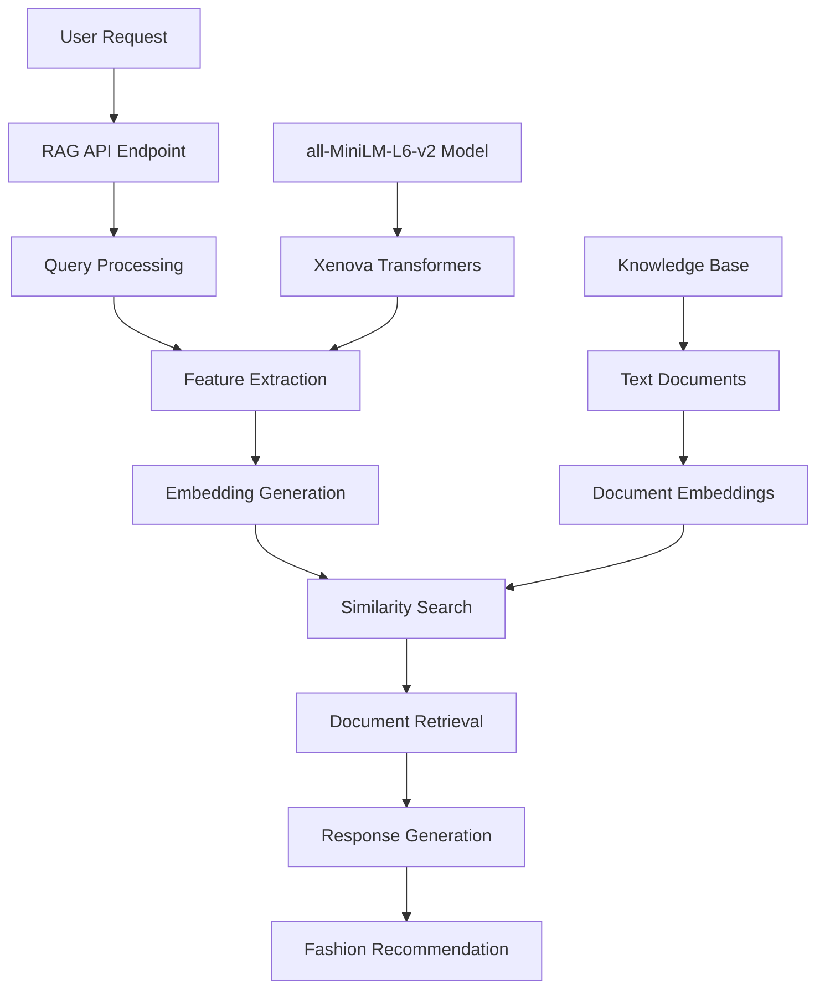

# RAG System Documentation - Fashion AI Project Advisor

## 📋 Overview

The Fashion AI Project Advisor uses a Retrieval-Augmented Generation (RAG) system to provide personalized fashion recommendations. This system combines semantic search with a curated knowledge base to deliver contextual styling advice based on user profiles, body types, skin tones, and occasions.

## 🏗️ Architecture

### System Components



### Core Technologies

- **Embedding Model**: `Xenova/all-MiniLM-L6-v2` via @xenova/transformers
- **Similarity Metric**: Cosine similarity
- **Knowledge Base**: Text files in `public/data/`
- **Runtime**: Next.js API Routes (serverless)

## 🔧 Implementation Details

### API Endpoint

**Location**: `src/app/api/rag/recommend/route.ts`

**Method**: `POST /api/rag/recommend`

**Request Body**:
```json
{
  "user_profile": {
    "skin_tone": "warm|cool|neutral",
    "body_type": "athletic|pear|apple|hourglass",
    "height": "number (cm)",
    "weight": "number (kg)",
    "bust": "number (cm)",
    "waist": "number (cm)",
    "hip": "number (cm)"
  },
  "clothing_item": {
    "color": "string",
    "type": "string"
  },
  "occasion": "casual|smart-casual|business|cocktail|formal|sporty"
}
```

**Response**:
```json
{
  "recommendation": "string - AI-generated fashion advice"
}
```

### Core Functions

#### 1. Knowledge Base Loading
```typescript
async function loadKnowledgeBase() {
  // Loads all .txt files from public/data/
  // Generates embeddings for each document
  // Caches embeddings in memory
}
```

#### 2. Query Processing
```typescript
// Constructs query text from user profile and preferences
let queryText = "";
if (user_profile) {
  queryText += `User has skin tone ${user_profile.skin_tone} and body type ${user_profile.body_type}. `;
  // ... additional profile details
}
```

#### 3. Similarity Search
```typescript
// Generates query embedding
const queryEmbedding = await featureExtractor(queryText, { pooling: 'mean', normalize: true });

// Calculates cosine similarity with all documents
const similarities = documentEmbeddings.map((docEmbed, index) => ({
  index,
  similarity: cosineSimilarity(queryEmbedding, docEmbed),
}));

// Retrieves top K most relevant documents
const topK = 2;
const retrievedDocuments = similarities.slice(0, topK).map(s => documents[s.index]);
```

## 📚 Knowledge Base

### Data Structure

The knowledge base consists of curated text files stored in `public/data/`:

| File | Purpose | Content |
|------|---------|---------|
| `body_type_advice.txt` | Body type styling | Advice for athletic, pear, apple, hourglass body types |
| `skin_tone_guide.txt` | Color matching | Color recommendations for warm, cool, neutral skin tones |
| `occasion_dressing_guide.txt` | Event styling | Outfit suggestions for different occasions |
| `color_matching_guide.txt` | Color coordination | Color theory and matching principles |
| `body_measurements_guide.txt` | Fit guidance | Size and fit recommendations |
| `height_weight_guide.txt` | Proportional styling | Styling advice based on body proportions |

### Content Format

Each knowledge base file follows a structured format:

```text
Category Name:
  - Characteristics: Description of the category
  - Styling Advice: Specific recommendations
  - Additional tips and considerations

Next Category:
  - Characteristics: ...
  - Styling Advice: ...
```

### Example Content

```text
Athletic Body Type:
  - Characteristics: Broad shoulders, narrow hips, less defined waist.
  - Styling Advice: Highlight curves with fitted clothing, wrap dresses, and belted waists. V-necks can soften broad shoulders. Avoid overly baggy clothes.

Warm Skin Tones:
  - Best colors: Earthy tones like olive green, brown, gold, rust, cream, and deep reds.
  - Avoid: Cool blues, silvers, and stark black.
  - Jewelry: Gold jewelry complements warm undertones.
```

## 🚀 Usage Examples

### Basic Recommendation Request

```javascript
const response = await fetch('/api/rag/recommend', {
  method: 'POST',
  headers: {
    'Content-Type': 'application/json',
  },
  body: JSON.stringify({
    user_profile: {
      skin_tone: 'warm',
      body_type: 'hourglass',
      height: 165,
      weight: 60
    },
    clothing_item: {
      color: 'blue',
      type: 'dress'
    },
    occasion: 'cocktail'
  }),
});

const data = await response.json();
console.log(data.recommendation);
```

### Integration in Components

The RAG system is integrated into several components:

1. **Virtual Try-On** (`src/app/(main)/project-advisor/virtual-try-on/page.tsx`)
2. **Outfit Builder** (`src/app/(main)/project-advisor/outfit-builder/page.tsx`)
3. **Visual Recommendations** (`src/components/project-advisor/VisualRecommendations.tsx`)

## ⚡ Performance Considerations

### Caching Strategy

- **Document Embeddings**: Generated once on first request, cached in memory
- **Model Loading**: Feature extraction model loaded once and reused
- **Serverless Optimization**: Cold start mitigation through singleton pattern

### Scalability

- **Memory Usage**: ~50MB for embeddings and model
- **Response Time**: ~200-500ms for recommendation generation
- **Concurrent Requests**: Handled by Next.js serverless functions

### Optimization Opportunities

1. **Pre-computed Embeddings**: Store embeddings in database
2. **Vector Database**: Use Pinecone, Weaviate, or similar for large-scale retrieval
3. **Model Optimization**: Use quantized models for faster inference
4. **Caching Layer**: Implement Redis for response caching

## 🔒 Security & Privacy

### Data Handling

- **User Profiles**: Processed in-memory, not stored permanently
- **Recommendations**: Generated on-demand, not cached
- **Knowledge Base**: Public fashion advice, no sensitive data

### API Security

- **Rate Limiting**: Implement to prevent abuse
- **Input Validation**: Sanitize all user inputs
- **Error Handling**: Graceful degradation on failures

## 🧪 Testing

### Unit Tests

```javascript
// Test embedding generation
test('should generate embeddings for text', async () => {
  const extractor = await getExtractor();
  const output = await extractor('test text', { pooling: 'mean', normalize: true });
  expect(output.data).toBeDefined();
});

// Test similarity calculation
test('should calculate cosine similarity', () => {
  const vec1 = [1, 0, 0];
  const vec2 = [0, 1, 0];
  const similarity = cosineSimilarity(vec1, vec2);
  expect(similarity).toBe(0);
});
```

### Integration Tests

```javascript
// Test full RAG pipeline
test('should return fashion recommendation', async () => {
  const response = await fetch('/api/rag/recommend', {
    method: 'POST',
    body: JSON.stringify({
      user_profile: { skin_tone: 'warm', body_type: 'athletic' },
      occasion: 'casual'
    })
  });
  
  const data = await response.json();
  expect(data.recommendation).toContain('Based on relevant information');
});
```

## 📈 Monitoring & Analytics

### Key Metrics

- **Request Volume**: Number of recommendation requests
- **Response Time**: Average API response time
- **Success Rate**: Percentage of successful recommendations
- **User Satisfaction**: Implicit feedback from user interactions

### Logging

```typescript
console.log("Knowledge base loaded and embeddings generated.");
console.log(`Retrieved ${retrievedDocuments.length} relevant documents`);
console.error("Error in RAG recommendation API:", error);
```

## 🔮 Future Enhancements

### Short-term Improvements

1. **Enhanced Knowledge Base**: Add more fashion categories and seasonal advice
2. **User Feedback Loop**: Learn from user interactions and preferences
3. **Multi-language Support**: Internationalization of fashion advice
4. **Image Integration**: Process clothing images for visual recommendations

### Long-term Vision

1. **Personalized Models**: Fine-tune embeddings based on user behavior
2. **Real-time Learning**: Update recommendations based on fashion trends
3. **Social Integration**: Incorporate community feedback and ratings
4. **Advanced AI**: Integration with GPT-4 or Claude for more sophisticated responses

## 📞 Support & Maintenance

### Common Issues

1. **Cold Start Delays**: First request may take longer due to model loading
2. **Memory Limits**: Large knowledge bases may exceed serverless memory limits
3. **Model Updates**: Updating the embedding model requires cache invalidation

### Maintenance Tasks

- **Knowledge Base Updates**: Regular content updates and expansions
- **Performance Monitoring**: Track response times and error rates
- **Model Evaluation**: Assess recommendation quality and user satisfaction

---

**Last Updated**: January 2025  
**Version**: 1.0  
**Maintainer**: Fashion AI Development Team
